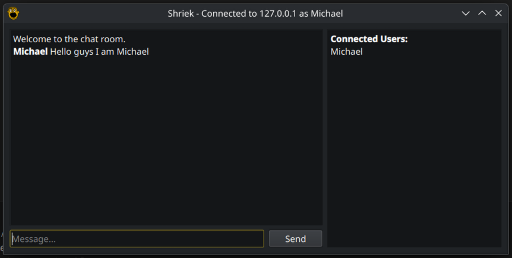

# Shriek

A simple text messaging program to replace Discord when it inevitably sucks.

## Usage
### Client
Simply download this repo and run `client.py` with your favorite Python interpreter. It should automatically install its dependencies. If you don't have a server to connect to, try to use `iamdying.boyne.dev`, and if I happen to be running it, you'll be in the clear.
### Server
Simply run `server.py` with your favorite Python interpreter. It has no dependencies you need to install.

## How it works
This application implements a custom protocol on top of TCP and Python sockets. All messages are sent in JSON format, and an ending character is added to the end of each JSON object to know when a communication ends. Each JSON object is given a name called a "type", which determines what the data in the object describes. There are data types for user messages, system messages, chat joining denials, etc.

## Will this actually replace Discord?
No. Use something that has voice calling. UDP is hard, man.